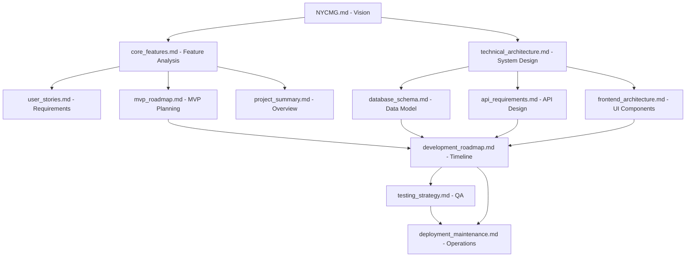

# NYCMG Documentation Index

This document provides an organized index of all documentation created for the NYCMG project, making it easy to navigate and reference the various aspects of the platform.

## Project Overview
- [NYCMG Concept Document](NYCMG.md) - Original vision and concept
- [Project Summary](project_summary.md) - Comprehensive project overview

## Technical Documentation
- [Technical Architecture](technical_architecture.md) - System architecture and technology stack
- [Database Schema](database_schema.md) - Data model and schema design
- [API Requirements](api_requirements.md) - API endpoints and requirements
- [Frontend Architecture](frontend_architecture.md) - Component architecture and design

## Product Development
- [Core Features](core_features.md) - Feature analysis and breakdown
- [User Stories](user_stories.md) - User requirements and acceptance criteria
- [MVP Roadmap](mvp_roadmap.md) - Minimum viable product planning

## Project Management
- [Development Roadmap](development_roadmap.md) - Timeline and resource planning
- [Testing Strategy](testing_strategy.md) - Quality assurance protocols
- [Deployment and Maintenance](deployment_maintenance.md) - Operations procedures

## Usage Instructions

To effectively navigate this documentation:

1. **Start with the Concept Document** to understand the vision
2. **Review the Project Summary** for a high-level overview
3. **Examine Technical Documentation** for implementation details
4. **Reference Product Development** for feature requirements
5. **Consult Project Management** for timeline and operational procedures

## Document Relationships

## Maintenance and Updates

This documentation set should be maintained as the project evolves:

- Update documents when requirements change
- Add new documents for additional features
- Archive deprecated documentation
- Regular review and validation of information accuracy

## Access and Permissions

All documentation is maintained in the project repository with appropriate access controls:

- Technical team: Full read/write access
- Stakeholders: Read access
- Public: Select documents as appropriate

For questions about any of these documents, please contact the project team.